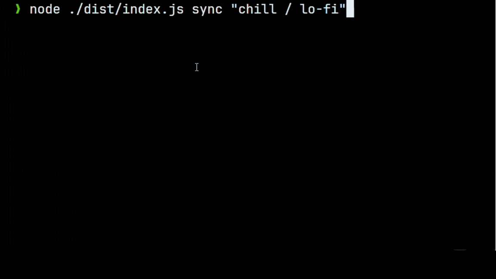

# ytsync

## Overview

This is a simple CLI tool that uses **Google's API** and **`yt-dlp`** to download and sync your youtube playlists

Its intended use is for Music Playlists / Podcasts / Audio Books (basically audio content).

## Table of Contents

-   [Prerequisites](#prerequisites)
-   [Installation](#installation)
-   [Google API Setup](#google-api-setup)
-   [Using the App](#using-the-app)
-   [How it Works](#what-does-sync-do-)
-   [Advanced Tips](#cool-things-you-can-do)

## Prerequisites

1. You need to have `node 18+` installed.

2. You need python and have the `yt-dlp` library installed.

3. A Google Cloud Project (Follow the setup guide below).

## Installation

1. Clone This Github Repo

2. Install npm packages

```bash
npm install
```

3. Make sure you have yt-dlp installed

```bash
pip install yt-dlp[default]
```

4. Build the App

```bash
npm run build
```

## Google API Setup

1. Go to [`Google Cloud Console`](https://console.cloud.google.com/welcome), then make a new project.
2. Then go to [`Overview`](https://console.cloud.google.com/auth/overview/create) then enter whatever name/email you want for the project, then in Audience pick `External`, then finish up.
3. Go To the [`Clients`](https://console.cloud.google.com/auth/client) Tab, then click `Create Client`.
4. Set the Application Type to be `Web Application`, at **Authorized redirect URIs** add this exact uri: `http://localhost:5000/callback`
5. Hit `Create` then store your `CLIENT_ID` and `CLIENT_SECRET` somewhere safe.
6. Go to [`youtubei`](https://console.cloud.google.com/apis/library/youtube.googleapis.com) and **Enable** it.
7. Click [`Data Access`](https://console.cloud.google.com/auth/scopes) tab on the left and click `Add or Remove Scopes` Then paste this into `Manually add Scopes` section, hit `add` then `update`.

    ```txt
    https://www.googleapis.com/auth/youtube.readonly
    ```

    make sure your scopes look like this:

    

8. Finally Add your Gmail accounts you want to use the CLI tool with in the [`Audience`](https://console.cloud.google.com/auth/audience) Tab as **Test Users**

## Using the App

### `init` command

> you need this before using other commands

1. Call the `init` command.

```bash
node ./dist/index.js init
```

2. copy paste your `CLIENT_ID` and `CLIENT_SECRET` from before.
3. Go to the local server to continue with google, it should automatically update your config file (you can add `--manual` with `init`)

4. You're Done! you can CTRL + C to exit the terminal now.

---

Now you can use the app's commands like

### `sync` command

-   sync : choose which playlist you wish to download/sync
-   sync <playlistName1> <playlistName2> ... : immediately sync playlist with given name(s)

there's also different flags you can use

| Flag             | Description                                                         |
| ---------------- | ------------------------------------------------------------------- |
| `--dry-run`      | Show what would be updated without downloading or deleting anything |
| `--verbose`      | Log everything                                                      |
| `--force`        | Re-download entire playlist                                         |
| `--format <ext>` | Choose audio format (some formats may not be available)             |

### `status` command

-   status: show all your local music and their diffs to the youtube ones.

## What does `sync` do ?

-   when you sync a playlist it downloads that playlist to `HOME/ytsync_Music/<NameOfPlaylist>`

-   and in that directory it saves a `status.json` file that keeps track of the playlist id and the songs inside by their id and names.

-   visually it look like this:

```txt
HOME/ytsync_Music/
└── Playlist Name/
    ├── Song1.mp3
    ├── Song2.mp3
    └── status.json

```

-   Deleting a song manually from the folder is ignored by the app; the app reads status.json as the source of truth. Songs removed from YouTube will be deleted automatically during sync.

-   so adding / deleting songs manually does absolutely _nothing_.

> [!Warning]
> You **SHOULD NOT** manually edit `status.json` file unless you know what you're doing.
> Song names should be exactly like their equivalent in `status.json` ==> **don't change song names**.

## Examples

### Dry run a playlist called "Chill / Lo-Fi"

```js
node ./dist/index.js sync --dry-run "Chill / Lo-Fi"
```


# Actually sync it

```js
node ./dist/index.js sync "chill / lo-fi"
```



## Cool things you can do (LINUX ONLY)

-   You can install the project globally

```bash
npm install -g .
```

> now you can directly call `ytsync` from anywhere on the terminal

-   You can schedule a cron job to make the command run every so often

    -   open your crontab

    ```bash
    crontab -e
    ```

    -   then paste this to sync your lists automatically everyday at 12:00 AM.

    ```bash
    0 0 * * * ytsync sync <playlistName1> <playlistName2> <playlistName3>
    ```
