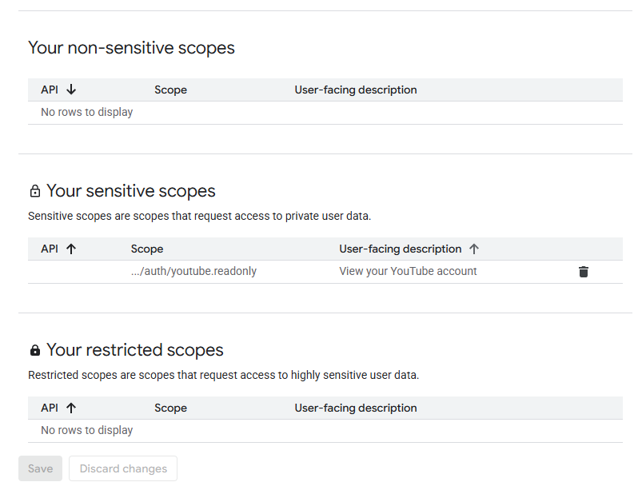

# ytsync

## Overview

This is a simple CLI tool that uses **Google's API** and **`yt-dlp`** to download and sync your youtube playlists

It's intended use is for Music Playlists / Podcasts / Audio Books (basically audio content).

## Dependencies

1. You need to have `node 18+` installed.

2. You need python and have the `yt-dlp` library installed.

3. You need a `CLIENT_ID` and `CLIENT_SECRET` from Google's Cloud API.

    1. Go to [`Google Cloud Console`](https://console.cloud.google.com/welcome), then make a new project.
    2. Then go to [`Overview`](https://console.cloud.google.com/auth/overview/create) then enter whatever name/email you want for the project, then in Audience pick `External`, then finish up.
    3. Go To the [`Clients`](https://console.cloud.google.com/auth/client) Tab, then click `Create Client`.
    4. Set the Application Type to be `Web Application`, at **Authorized redirect URIs** add this exact uri: `http://localhost:5000/callback`
    5. Hit `Create` then store your `CLIENT_ID` and `CLIENT_SECRET` somewhere safe.
    6. Click [`Data Access`](https://console.cloud.google.com/auth/scopes) tab on the left and click `Add or Remove Scopes` Then paste this into `Manually add Scopes` section, hit `add` then `update`.

        make sure your scopes look like this:

     

    7. Finally Add your Gmail accounts you want to use the CLI tool with in the [`Audience`](https://console.cloud.google.com/auth/audience) Tab as **Test Users**

## Installation

1. Clone This Github Repo

2. Install npm packages

```sh
npm install
```

3. Make sure you have yt-dlp installed

```sh
pip install yt-dlp[default]
```

4. Build the App

```sh
npm run build
```

5. You can start Using the app!

## Using the App

1. Call the `init` command.

```sh
node ./dist/index.js init
```

2. copy paste your `CLIENT_ID` and `CLIENT_SECRET` from before.
3. Go to the local server to continue with google, then copy paste your `access_token` and `refresh_token`

4. You're Done! you can CTRL + C to exit the terminal now.

---

Now you can use the app's commands like

### `sync` command

-   sync : chose which playlist you wish to download/sync
-   sync <playlistName1> <playlistName2> ... : immediately sync playlist with given name(s)

there's also different flags you can use

-   `--dry-run`: to see what would be updated
-   `--verbose`: to log everything.
-   `--force`: to re-download the entire playlist.
-   `--format`: you can chose different audio formats. (keep in mind `opus`/`flac` might not be available)

### `status` command

-   status: show all your local music and their diffs to the youtube ones.

## TODOs:

3. make the server automatically add the refresh and access tokens in the config file.
